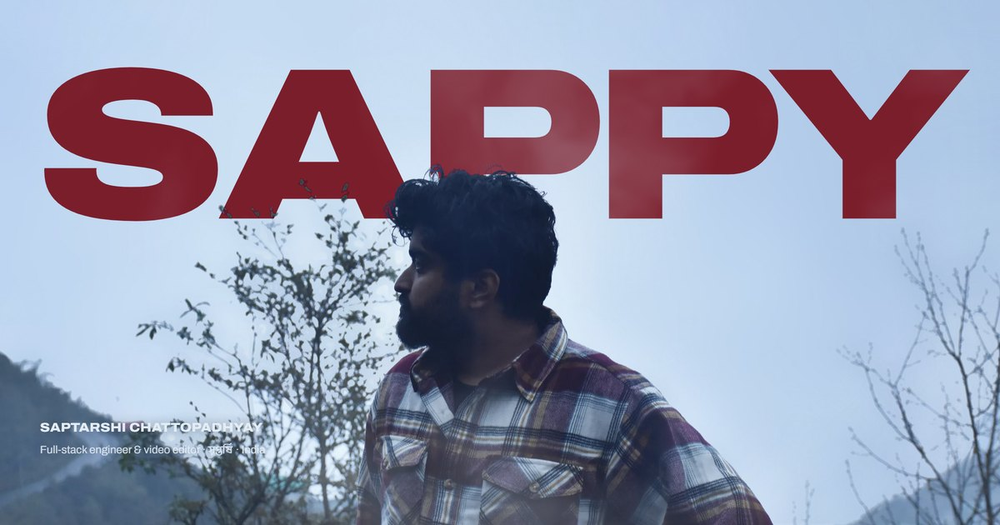

# devsappy.space



Portfolio of **Saptarshi Chattopadhyay (Sappy)**: full-stack engineer and video editor, India.

The site is built as an edit. Scrolling scrubs a playhead along a timeline, timecode runs at 25 fps, the work plays as footage, and the experience rolls as end credits.

## What's on the page

- **Opening shot.** The hero is one photograph (`DSC_8261.JPG`) split into a clean sky plate and a keyed foreground cut-out. The title sits between them, so "SAPPY" hangs in the sky behind his head. Two WebGL mist layers drift on either side of the cut-out and part around the cursor. On load the frame grades in from flat and the title racks into focus. On scroll the camera pushes in and the frame dissolves to mist.
- **Timeline.** A fixed strip at the bottom. Every `[data-clip]` section becomes a clip, sized by its share of the scroll and tinted with its own background, so the strip is also the page's colour script. Drag to scrub, click a clip to jump, or use **J / K / L** (reverse, stop, play; press again for 2× and 4×). At 1× the timecode runs in real time.
- **Selects.** Six live projects, shown as screen recordings captured from the deployed sites. On desktop one program monitor stays pinned and hard-cuts between projects as you scroll. On phones it becomes a list where each recording plays while in view.
- **Credits.** Experience, education and tools, set like film end credits.
- **End card.** Contact under a night sky with Saptarshi (সপ্তর্ষি), the seven sages: the Indian name for the Big Dipper. Star positions are real J2000 coordinates.
- **Work.** `/projects` pairs a project list with a monitor that switches between the recording and the live site. Each project also has its own case study at `/projects/<name>`: the recording, an overview, stills from the live site, and technical specs (typefaces, palette and sections, read from the deployed page).
- **Services.** `/services` plus one page each for website development, video editing and 3D & WebGL websites. Each has an answer-first summary, scope, related work, process and FAQ.
- **Journal.** `/blog` with five articles. Two are making-of pieces on the hero key and the timeline. Three cover Next.js, video for the web and design systems, grounded in how this site was built.
- **About and contact.** `/sappy` has the bio and the career drawn as tracks on a timeline. `/contact` has a form that drafts the email in the visitor's mail app (there's no backend).
- **404.** A red "Media offline" frame, the screen Premiere Pro shows when footage is missing.

## Design system

| Token | Hex | From the photo |
| --- | --- | --- |
| Mist | `#D6E3F2` | the haze over the hills |
| Ink | `#0B1220` | hair and shadow |
| Oxblood | `#7B1E2C` | the red the eye reads in the plaid |
| Dusk / Night | `#0D1420` / `#060A12` | where the page ends up |
| Tally | `#FF5B4F` | the playhead, "playing" and "now" lights, and form errors |

Type is a single family, Archivo, used across widths: 125% for titles, 100% for reading, 75% for labels. Martian Mono covers timecode and data, and Anek Bangla covers the Bengali.

## Stack

Next.js 14 (App Router, every route statically prerendered), vanilla CSS, raw WebGL for the mist (no 3D library), and [Lenis](https://github.com/darkroomengineering/lenis) for smooth scrolling. Lenis is switched off under `prefers-reduced-motion`; in that mode the hero renders as a still and recordings don't autoplay.

## Content

| File | What it holds |
| --- | --- |
| `lib/content.js` | Name, location, links, projects, experience, education, tools, clients |
| `lib/projects-detail.js` | Case-study copy, stills and specs for each project |
| `lib/services.js` | The three service pages, including their FAQs |
| `lib/journal/*.js` | One file per article, as structured data (see the header of `lib/journal/index.js`) |

Every page, the sitemap, the RSS feed, `llms.txt` and the structured data are generated from these files, so they can't disagree. To add an article, create a file in `lib/journal/` and add it to the list in `lib/journal/index.js`.

`person.city` in `lib/content.js` sets the location shown across the site and in search data (currently Kolkata). `person.reel` takes a YouTube or Vimeo showreel URL; once set, the video-editing page links to it.

## SEO and AI search

- **Structured data.** Every page outputs a JSON-LD graph that links back to one Person (`#person`) and one WebSite. It includes ProfilePage (about), CreativeWork and VideoObject (each case study), Service and FAQPage (services), BlogPosting and Blog (journal), and BreadcrumbList on every inner page.
- **Metadata.** Every page has its own title, description, canonical URL and 1200×630 share image (`public/og/`). Google may show large image previews and video previews.
- **Crawling.** `/sitemap.xml` lists every page with fixed dates. `/robots.txt` explicitly allows AI search crawlers (GPTBot, OAI-SearchBot, ClaudeBot, PerplexityBot, Google-Extended and others) and blocks Bytespider.
- **For AI assistants.** `/llms.txt` is a summary of the site, and `/llms-full.txt` holds every service page, case study and article as Markdown. `/rss.xml` is the journal feed.
- **Redirects.** `/about`, `/work`, `/journal` and `/feed` point to their real pages.

### After you deploy

1. **Google Search Console.** Add a Domain property for `devsappy.space` (verified by DNS, it covers both www and the bare domain), or a URL-prefix property for `https://www.devsappy.space` verified with `GOOGLE_SITE_VERIFICATION`. Submit `https://www.devsappy.space/sitemap.xml`.
   The official address is `https://www.devsappy.space`. In Vercel → Settings → Domains, set the `devsappy.space` redirect to **308 (permanent)**; it defaults to 307 (temporary).
2. **Bing Webmaster Tools.** Import the site from Search Console, or set `BING_SITE_VERIFICATION`. Bing's index also feeds ChatGPT search and Copilot.
3. **Ping IndexNow** after each deploy: `npm run indexnow`. It submits every sitemap URL to Bing and the other IndexNow engines. The key file is `public/515efbbfe117106685d639cf0e4eed8f.txt`.
4. **Off-site.** Link this site from LinkedIn, GitHub and any profile you keep (Behance, Dribbble, YouTube, Upwork), and add a "Site by Sappy" credit link to the footer of each project you build. Add new profiles to `sameAs` in `lib/seo.js`.

### Re-recording project footage

`public/work/<slug>.mp4` and `<slug>.webp` are a scroll-through recording and a poster of each live site, at 1200 px wide, H.264 and about 1 MB each. If a project changes, record it again at 1440×900 and encode it with:

```
ffmpeg -i capture.mp4 -vf "fps=25,scale=1200:-2,format=yuv420p" -c:v libx264 -crf 31 -g 50 -movflags +faststart -an public/work/<slug>.mp4
```

## Getting started

```
npm install
npm run dev
```

Then open http://localhost:3000.

---

Push initiated by Claude

